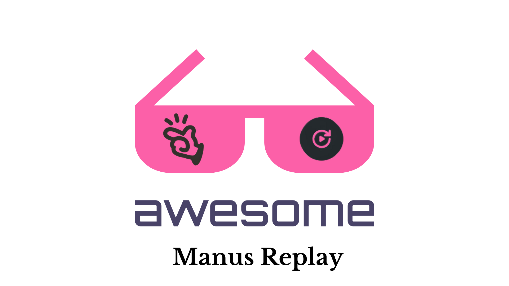

# awesome-manus-replay

Currently collecting some awesome Manus replays.

## What is Manus?
Manus is a general AI agent developed by a Chinese team called Monica, designed to assist users in completing a variety of complex tasks. Its capabilities include, but are not limited to:

- **Task Execution**: Manus can independently perform a wide range of tasks such as writing articles, creating presentations, coding, and conducting data analysis. Users only need to provide simple instructions, and Manus delivers complete results rather than just suggestions or answers.
- **Powerful Tool Invocation**: Manus has the ability to automatically invoke external tools like web browsers, code editors, and data analysis applications, allowing it to understand user needs and complete complex tasks .
- **Outstanding Performance in GAIA Benchmark**: Manus has reportedly outperformed competitors like OpenAI's Deep Research in the GAIA benchmark test, showcasing its advanced capabilities in the realm of general AI assistants .

## Manus Replay
Manus Replay is a feature that allows users to view and replay the process by which Manus executes tasks. This functionality enables users to understand how Manus approaches specific tasks, including its thought processes and the steps it takes. This serves as a valuable learning tool for users, helping them 
comprehend the workings and decision-making processes of the AI .

[English UseCases](#english-use-cases) | [中文用例](#中文用例)

## English Usecases

### Finance and Investment Analysis
1. **Comprehensive Tesla Stock Analysis and Investment Insights**
   - **Description**: Conduct an in-depth analysis of Tesla stock, including: company overview, key metrics, performance data, and investment recommendations; financial data: revenue trends, profit margins, balance sheet, and cash flow analysis; market sentiment: analyst ratings, sentiment indicators, and news impact; technical analysis: price trends, technical indicators, and support/resistance levels; asset comparison: market share and financial metrics compared to key competitors; value investing: intrinsic value, growth potential, and risk factors; investment thesis: SWOT analysis and advice for different investor types.
   - **Link**: [https://manus.im/share/xFgpHb15vKqfRPWIs3JJPJ](https://manus.im/share/xFgpHb15vKqfRPWIs3JJPJ)  |  [**Replay**](https://manus.im/share/xFgpHb15vKqfRPWIs3JJPJ?replay=1)
   - **Example Website**: [https://pljclduq.manus.space/](https://pljclduq.manus.space/)

2. **Sales Analysis and Strategies for Amazon Store**
   - **Description**: Analyze my Amazon store sales data from last month (provided), present it with visualizations, and propose specific, data-driven strategies to increase sales by 10% next month.
   - **Link**: [https://manus.im/share/c3onakN6Iajcm1Vt1xAVG7](https://manus.im/share/c3onakN6Iajcm1Vt1xAVG7)  |  [**Replay**](https://manus.im/share/c3onakN6Iajcm1Vt1xAVG7?replay=1)
   - **Attachment**: [Amazon_Fashion_Sales_Analysis_Report.md](./Attachments/c3onakN6Iajcm1Vt1xAVG7/Amazon_Fashion_Sales_Analysis_Report.md)

3. **Salesforce Agent Product Analysis and Outlook**
   - **Description**: Conduct an in-depth analysis of Salesforce and its agent products, exploring their market outlook.
   - **Link**: [https://manus.im/share/ls6jeWDl5omY1N0gel9RA2](https://manus.im/share/ls6jeWDl5omY1N0gel9RA2)  |  [**Replay**](https://manus.im/share/ls6jeWDl5omY1N0gel9RA2?replay=1)
   - **Attachment**: [salesforce_agentforce_market_calculator_report.md](./Attachments/ls6jeWDl5omY1N0gel9RA2/salesforce_agentforce_market_calculator_report.md)

4. **AWS Performance Metrics and $10T Market Valuation Analysis**
   - **Description**: Analyze AWS performance metrics and evaluate its potential to reach a $10 trillion market valuation.
   - **Link**: [https://manus.im/share/FJluiQ5X6KZTNLWbEB3uL0](https://manus.im/share/FJluiQ5X6KZTNLWbEB3uL0)  |  [**Replay**](https://manus.im/share/FJluiQ5X6KZTNLWbEB3uL0?replay=1)

5. **Amazon Earnings Call Analysis and Market Sentiment Shifts**
   - **Description**: Analyze Amazon’s recent earnings call, identifying key points and shifts in market sentiment.
   - **Link**: [https://manus.im/share/AZez7mV40jOYmRSgYBu6v3](https://manus.im/share/AZez7mV40jOYmRSgYBu6v3)  |  [**Replay**](https://manus.im/share/AZez7mV40jOYmRSgYBu6v3?replay=1)

### Health and Lifestyle
6. **Comprehensive Health Plan for Elon Musk**
   - **Description**: Develop a comprehensive health plan for Elon Musk, including: health data summary: current health status, key metrics, fitness level, and risks based on web data; fitness goals: specific endurance, strength, and longevity targets; lifestyle habits: analysis of diet, sleep, and exercise routines; health improvement strategies: aggressive approaches using advanced medical and fitness solutions; comparative analysis: comparison with health plans of other high-workload individuals; longevity considerations: strategies for extending lifespan and maintaining peak health.
   - **Link**: [https://manus.im/share/6rT11DpPs4tU5j8x12w6se](https://manus.im/share/6rT11DpPs4tU5j8x12w6se)  |  [**Replay**](https://manus.im/share/6rT11DpPs4tU5j8x12w6se?replay=1)
   - **Attachment**: [comprehensive_health_plan.md](./Attachments/6rT11DpPs4tU5j8x12w6se/comprehensive_health_plan.md)

7. **7-Day Japan Itinerary with Proposal Ideas**
   - **Description**: Design a 7-day Japan travel itinerary including romantic proposal ideas.
   - **Link**: [https://manus.im/share/brWKUSp51ItvVMBpcXNCZ1](https://manus.im/share/brWKUSp51ItvVMBpcXNCZ1)  |  [**Replay**](https://manus.im/share/brWKUSp51ItvVMBpcXNCZ1?replay=1)

### Education and Visualization
8. **Conservation of Momentum Teaching Animations and Presentation**
   - **Description**: I’m a high school physics teacher preparing to teach the law of conservation of momentum. Create a series of clear, accurate demonstration animations and organize them into a simple HTML presentation page.
   - **Link**: [https://manus.im/share/pAdLIvlktJmV945593mFio](https://manus.im/share/pAdLIvlktJmV945593mFio)  |  [**Replay**](https://manus.im/share/pAdLIvlktJmV945593mFio?replay=1)
   - **Example Website**: [https://iciwktuq.manus.space/](https://iciwktuq.manus.space/)

9. **Interactive Webpage for Learning Transformer Architecture**
   - **Description**: Create an interactive webpage to help users learn the principles and applications of the Transformer architecture through visualization.
   - **Link**: [https://manus.im/share/oNNCT4ced1raFXdewLKSBg](https://manus.im/share/oNNCT4ced1raFXdewLKSBg)  |  [**Replay**](https://manus.im/share/oNNCT4ced1raFXdewLKSBg?replay=1)

### Website and Design
10. **SEO Audit and Optimization Report for Karpathy's Website**
    - **Description**: Conduct an SEO audit for Karpathy’s website and provide an optimization report with actionable recommendations.
    - **Link**: [https://manus.im/share/AWssWxITcsrl70js5L8LgU](https://manus.im/share/AWssWxITcsrl70js5L8LgU)  |  [**Replay**](https://manus.im/share/AWssWxITcsrl70js5L8LgU?replay=1)

11. **Minimalist Business Card Design Inspired by Apple**
    - **Description**: Design a minimalist business card inspired by Apple’s design philosophy.
    - **Link**: [https://manus.im/share/Wnv6aMdSowbdmskzzAqkD4](https://manus.im/share/Wnv6aMdSowbdmskzzAqkD4)  |  [**Replay**](https://manus.im/share/Wnv6aMdSowbdmskzzAqkD4?replay=1)

### Other Tasks
12. **Interview Schedule Creation for April 13-15**
    - **Description**: Create an interview schedule for April 13-15, including time slots and participant details.
    - **Link**: [https://manus.im/share/AN3pVVcq4qHnWbC55XhAYB](https://manus.im/share/AN3pVVcq4qHnWbC55XhAYB)  |  [**Replay**](https://manus.im/share/AN3pVVcq4qHnWbC55XhAYB?replay=1)

13. **Customer Form for B2B Gen AI Consulting Firms**
    - **Description**: Design a customer intake form tailored for B2B generative AI consulting firms.
    - **Link**: [https://manus.im/share/YIRZaLUfghVxGCN7dE6hbI](https://manus.im/share/YIRZaLUfghVxGCN7dE6hbI)  |  [**Replay**](https://manus.im/share/YIRZaLUfghVxGCN7dE6hbI?replay=1)

14. **Contract Review and Error Correction Request**
    - **Description**: Review a contract and identify errors, providing suggestions for correction.
    - **Link**: [https://manus.im/share/C54gwsF9Aafq74DGIRBUW5](https://manus.im/share/C54gwsF9Aafq74DGIRBUW5)  |  [**Replay**](https://manus.im/share/C54gwsF9Aafq74DGIRBUW5?replay=1)

15. **Lease Contract Key Information Table**
    - **Description**: Extract key information from a lease contract and present it in a clear table format.
    - **Link**: [https://manus.im/share/ihhSAR7qTSR6OkxLby6gId](https://manus.im/share/ihhSAR7qTSR6OkxLby6gId)  |  [**Replay**](https://manus.im/share/ihhSAR7qTSR6OkxLby6gId?replay=1)

16. **Best Price for Rubber Mats**
    - **Description**: Research and recommend the best price options for purchasing rubber mats.
    - **Link**: [https://manus.im/share/j7BUZNaC7vxEpqBU5GYQOR](https://manus.im/share/j7BUZNaC7vxEpqBU5GYQOR)  |  [**Replay**](https://manus.im/share/j7BUZNaC7vxEpqBU5GYQOR?replay=1)

17. **Mobile Data Consumption Patterns Thanksgiving Weekend Analysis**
    - **Description**: Analyze mobile data consumption patterns during the Thanksgiving weekend and present findings.
    - **Link**: [https://manus.im/share/f878HJiFifFQca1f0tckhQ](https://manus.im/share/f878HJiFifFQca1f0tckhQ)  |  [**Replay**](https://manus.im/share/f878HJiFifFQca1f0tckhQ?replay=1)

### **Environmental and Societal Impact**
18. **Create a detailed report on the impacts of climate change on Earth and human society in the next century**  
   - **Description**: Create a detailed report on the impacts of climate change on Earth and human society in the next century.  
   - **Link**: [https://manus.im/share/WB6qiUBGeXHI9gpu1MlW25](https://manus.im/share/WB6qiUBGeXHI9gpu1MlW25)  |  [**Replay**](https://manus.im/share/WB6qiUBGeXHI9gpu1MlW25?replay=1)(https://manus.im/share/WB6qiUBGeXHI9gpu1MlW25?replay=1)

19. **Draft a proposal for a solar-powered self-sufficient home at the coordinates 42°45'50.1"N 20°03'27.0"E**  
   - **Description**: Draft a proposal for a solar-powered self-sufficient home at the coordinates 42°45'50.1"N 20°03'27.0"E. The house should be 200 square meters, single-story, with three attached garages, equipped with geothermal HVAC (heat pump), gravity/soil filters, an independent plumbing system, solar power, and a 72-hour battery backup.  
   - **Link**: [https://manus.im/share/54gYsjcwsi8nDvG0PybWDe](https://manus.im/share/54gYsjcwsi8nDvG0PybWDe)  |  [**Replay**](https://manus.im/share/54gYsjcwsi8nDvG0PybWDe?replay=1)(https://manus.im/share/54gYsjcwsi8nDvG0PybWDe?replay=1)

### **Data Analysis and Visualization**
20. **Create a quadrant chart to visualize the scoring efficiency of all NBA players**  
   - **Description**: I need to create a quadrant chart that uses scoring and field goal percentage to position each player’s avatar coordinates, generating an intuitive visualization of scoring efficiency for all NBA players.  
   - **Link**: [https://manus.im/share/gsehnGPo5AyhGy6xpi4iR3](https://manus.im/share/gsehnGPo5AyhGy6xpi4iR3)  |  [**Replay**](https://manus.im/share/gsehnGPo5AyhGy6xpi4iR3?replay=1)(https://manus.im/share/gsehnGPo5AyhGy6xpi4iR3?replay=1)

21. **Identify the largest real estate brokerages in the top ten major metropolitan areas**  
   - **Description**: Identify the largest real estate brokerages in the top ten major metropolitan areas and break them down by number of agents, total transactions, total revenue, and average commission per deal.  
   - **Link**: [https://manus.im/share/qinzRC0m770weHZbbLkmjk](https://manus.im/share/qinzRC0m770weHZbbLkmjk)  |  [**Replay**](https://manus.im/share/qinzRC0m770weHZbbLkmjk?replay=1)(https://manus.im/share/qinzRC0m770weHZbbLkmjk?replay=1)

### **Technology and Product Research**
22. **Help me with product research by comparing and analyzing all MacBook models in Apple’s history**  
   - **Description**: Can you help me with product research? For example, can you compare and analyze all MacBook models in Apple’s history?  
   - **Link**: [https://manus.im/share/5zvwZicGyNCTWCzsLSGzBe](https://manus.im/share/5zvwZicGyNCTWCzsLSGzBe)  |  [**Replay**](https://manus.im/share/5zvwZicGyNCTWCzsLSGzBe?replay=1)(https://manus.im/share/5zvwZicGyNCTWCzsLSGzBe?replay=1)

23. **Analyze TSMC’s $100 billion investment in the U.S.**  
   - **Description**: TSMC is investing $100 billion in the U.S. for new factories, etc. Analyze their financial status, funding methods, potential fund allocation, and what this means for their market position and the U.S. economy.  
   - **Link**: [https://manus.im/share/36yJyaKuyny4tVUrqcQupK](https://manus.im/share/36yJyaKuyny4tVUrqcQupK)  |  [**Replay**](https://manus.im/share/36yJyaKuyny4tVUrqcQupK?replay=1)(https://manus.im/share/36yJyaKuyny4tVUrqcQupK?replay=1)

24. **Create a dynamic teaching webpage for quantum computing**  
   - **Description**: Create a dynamic teaching webpage for quantum computing.  
   - **Link**: [https://manus.im/share/I1HGZeicXgHhRfgI8xxjMM](https://manus.im/share/I1HGZeicXgHhRfgI8xxjMM)  |  [**Replay**](https://manus.im/share/I1HGZeicXgHhRfgI8xxjMM?replay=1)(https://manus.im/share/I1HGZeicXgHhRfgI8xxjMM?replay=1)

### **Travel and Outdoor Activities**
25. **Research the best hiking trails in the Swiss Alps**  
   - **Description**: Research the best hiking trails in the Swiss Alps.  
   - **Link**: [https://manus.im/share/j7QbBlHEO5kSE99KglmbJ9](https://manus.im/share/j7QbBlHEO5kSE99KglmbJ9)  |  [**Replay**](https://manus.im/share/j7QbBlHEO5kSE99KglmbJ9?replay=1)(https://manus.im/share/j7QbBlHEO5kSE99KglmbJ9?replay=1)

26. **Plan a two-month family trip for three people during the upcoming summer vacation (July to September)**  
   - **Description**: Can you help me plan a two-month family trip for three people during the upcoming summer vacation (July to September)? Include one month in Australia, followed by New Zealand, Argentina (and other parts of South America), and Antarctica. Provide itinerary details, accommodation recommendations, budget estimates, and food guides, then generate a detailed travel handbook.  
   - **Link**: [https://manus.im/share/7smHTo1ES2bgKtN2qz6a5i](https://manus.im/share/7smHTo1ES2bgKtN2qz6a5i)  |  [**Replay**](https://manus.im/share/7smHTo1ES2bgKtN2qz6a5i?replay=1)(https://manus.im/share/7smHTo1ES2bgKtN2qz6a5i?replay=1)

27. **Find round-trip non-stop flights from Seattle to London during the Wimbledon Championships**  
   - **Description**: I need round-trip non-stop flights from Seattle to London during the Wimbledon Championships, valid for about one week (5-8 days). Dates are flexible within that period. Tickets must have lie-flat seats and be fully refundable. Provide 10 good options, sorted by lowest price, with direct booking links.  
   - **Link**: [https://manus.im/share/7nHlnYtHA4ZJAUlVMOB6Ns](https://manus.im/share/7nHlnYtHA4ZJAUlVMOB6Ns)  |  [**Replay**](https://manus.im/share/7nHlnYtHA4ZJAUlVMOB6Ns?replay=1)(https://manus.im/share/7nHlnYtHA4ZJAUlVMOB6Ns?replay=1)

### **Creative Tools and Writing**
28. **Simplify scriptwriting and plot development for a video production and narrative design creator**  
   - **Description**: As a self-media creator specializing in video production (filming/editing) and narrative design for over 3 years, I need you to use tools to simplify scriptwriting and plot development. Key requirement: Script creation tools for dialogue/storyboards.  
   - **Link**: [https://manus.im/share/6a3roFwgj97Cs3UJJDvGlD](https://manus.im/share/6a3roFwgj97Cs3UJJDvGlD)  |  [**Replay**](https://manus.im/share/6a3roFwgj97Cs3UJJDvGlD?replay=1)(https://manus.im/share/6a3roFwgj97Cs3UJJDvGlD?replay=1)

29. **Write a short science fiction story based on cutting-edge physics discoveries**  
   - **Description**: Write a short science fiction story based on cutting-edge physics discoveries. It should have a solid scientific foundation and an O. Henry-style ending.  
   - **Link**: [https://manus.im/share/uxbUSW7vlR0EfOb7l5vPTk](https://manus.im/share/uxbUSW7vlR0EfOb7l5vPTk)  |  [**Replay**](https://manus.im/share/uxbUSW7vlR0EfOb7l5vPTk?replay=1)(https://manus.im/share/uxbUSW7vlR0EfOb7l5vPTk?replay=1)

### **Scientific Research and Innovation**
30. **Provide a detailed plan for designing a room-temperature superconductor via computer simulation**  
   - **Description**: Provide a detailed plan for designing a room-temperature superconductor via computer simulation.  
   - **Link**: [https://manus.im/share/1Swjk9Byzk0JplZyFO97EQ](https://manus.im/share/1Swjk9Byzk0JplZyFO97EQ)  |  [**Replay**](https://manus.im/share/1Swjk9Byzk0JplZyFO97EQ?replay=1)(https://manus.im/share/1Swjk9Byzk0JplZyFO97EQ?replay=1)

31. **Summarize the latest progress in high-temperature superconductivity research and suggest 10 PhD directions**  
   - **Description**: Summarize the latest progress in high-temperature superconductivity research and suggest 10 directions that could be explored for a physics PhD.  
   - **Link**: [https://manus.im/share/3bT5qfSNpEKDIFJJHXKhis](https://manus.im/share/3bT5qfSNpEKDIFJJHXKhis)  |  [**Replay**](https://manus.im/share/3bT5qfSNpEKDIFJJHXKhis?replay=1)(https://manus.im/share/3bT5qfSNpEKDIFJJHXKhis?replay=1)

32. **Integrate LLMs’ symbolic reasoning with robotic reinforcement learning for a grasping task**  
   - **Description**: How can the symbolic reasoning capabilities of LLMs be combined with robotic reinforcement learning (e.g., RT-2)? Design a language-instruction-based grasping task where the model generates a robust control strategy for objects with unseen geometric parameters (achieving >90% success rate under ±15% parameter perturbation), and clearly define the final output specifications, including policy matrix, stability proof, and failure mode analysis.  
   - **Link**: [https://manus.im/share/p7r30L2z544oqW3LB5K8bW](https://manus.im/share/p7r30L2z544oqW3LB5K8bW)  |  [**Replay**](https://manus.im/share/p7r30L2z544oqW3LB5K8bW?replay=1)(https://manus.im/share/p7r30L2z544oqW3LB5K8bW?replay=1)

### **Literature and Media Studies**
33. **Create a table of the best books on media and linguistics published in France from 2019 to 2025**  
   - **Description**: I want Manus to create a table listing the best books on media and linguistics (as separate topics) published in France from 2019 to 2025. Summarize why they are the best. Each category should have at least 15 books, covering Dewey Decimal ranges 070 to 099 and 400 to 409.  
   - **Link**: [https://manus.im/share/mvppKbruZGKLeIGDfuLRVw](https://manus.im/share/mvppKbruZGKLeIGDfuLRVw)  |  [**Replay**](https://manus.im/share/mvppKbruZGKLeIGDfuLRVw?replay=1)(https://manus.im/share/mvppKbruZGKLeIGDfuLRVw?replay=1)

### **Astronomy and Historical Analysis**
34. **Debunk or confirm the “Christmas Star” phenomenon of Jupiter and Saturn every 800 years**  
   - **Description**: Debunk or confirm whether Jupiter and Saturn align so closely that they create a special “Christmas Star” every 800 years or so, including an occurrence around 0 AD, providing convincing evidence without relying on other sources.  
   - **Link**: [https://manus.im/share/rK3HzIGPADmsxXuETdAoBP](https://manus.im/share/rK3HzIGPADmsxXuETdAoBP)  |  [**Replay**](https://manus.im/share/rK3HzIGPADmsxXuETdAoBP?replay=1)(https://manus.im/share/rK3HzIGPADmsxXuETdAoBP?replay=1)

35. **Research how fire control technologies aided the U.S. Pacific Fleet in WWII**  

   - **Description**: Research damage control, particularly how fire control technologies helped the U.S. Pacific Fleet resist air attacks and ultimately defeat Japan during WWII. Focus on the Pearl Harbor attack, the Battle of Midway, and the Battle of the Coral Sea.  
   - **Link**: [https://manus.im/share/H6IP1nwQNuXArPDQpXLNu9](https://manus.im/share/H6IP1nwQNuXArPDQpXLNu9)  |  [**Replay**](https://manus.im/share/H6IP1nwQNuXArPDQpXLNu9?replay=1)(https://manus.im/share/H6IP1nwQNuXArPDQpXLNu9?replay=1)

36. **Generate SEO-Friendly Blog That Passes Google AI Test**  
   - **Description**: A guide on creating blog content optimized for SEO and compliant with Google’s AI content detection standards.  
   - **Link**: [https://manus.im/share/xXJI86iOnCN86hsDgUCBZU](https://manus.im/share/xXJI86iOnCN86hsDgUCBZU) | [**Replay**](https://manus.im/share/xXJI86iOnCN86hsDgUCBZU?replay=1)

37. **New Ways to Play The Sims**  
   - **Description**: A YouTube script exploring player types, motivations, and innovative ways to enjoy The Sims, tailored for fans.  
   - **Link**: [https://manus.im/share/FM1Kbc0Ul2vOykxEfmUdDd](https://manus.im/share/FM1Kbc0Ul2vOykxEfmUdDd) | [**Replay**](https://manus.im/share/FM1Kbc0Ul2vOykxEfmUdDd?replay=1)

38. **Challenges in Adapting ICE for Titan’s Conditions**  
   - **Description**: A study on the technical challenges of adapting internal combustion engines (ICE) to Titan’s methane-rich atmosphere and extreme conditions.  
   - **Link**: [https://manus.im/share/9zuRPEpMjdfNYpKSf3sDMm](https://manus.im/share/9zuRPEpMjdfNYpKSf3sDMm) | [**Replay**](https://manus.im/share/9zuRPEpMjdfNYpKSf3sDMm?replay=1)

39. **YTD Performance of MEGA7 Stocks**  
   - **Description**: A report on the year-to-date performance of the MEGA7 stocks as of March 08, 2025, based on available financial data.  
   - **Link**: [https://manus.im/share/bVaDFiTxVQE2J1ZDPl2uf1](https://manus.im/share/bVaDFiTxVQE2J1ZDPl2uf1) | [**Replay**](https://manus.im/share/bVaDFiTxVQE2J1ZDPl2uf1?replay=1)

40. **4-Day Romantic Break in Europe Itinerary**  
   - **Description**: Help me plan a 4-day romantic break in Europe for 2 people, during the next 2 months. Please include itinerary arrangements, accommodation recommendations, budget estimates, and a food guide, and then generate a detailed travel handbook. Keep the budget at £1000 maximum, give me at least 5 options in different European countries, provide a detailed list of the itinerary including prices for travel, accommodation, and places, remember accommodation can be a hotel or an Airbnb, within the next 2 months choose the cheapest price to go and avoid UK school holidays.  
   - **Link**: [https://manus.im/share/1aFCsTNjzNjHeEHqKVIExO](https://manus.im/share/1aFCsTNjzNjHeEHqKVIExO) | [**Replay**](https://manus.im/share/1aFCsTNjzNjHeEHqKVIExO?replay=1)  

41. **Accelerated Freezing Machine Concept and Research Review**  
   - **Description**: As an advanced AI assistant, I task you with researching and synthesizing all available research papers, articles, and posts related to the development of an accelerated freezing machine designed as a home appliance, capable of freezing items extremely quickly, analogous to how a microwave heats items rapidly. Your objective is to:  
     - Conduct a comprehensive review of existing literature and online content, including academic papers, patents, and relevant discussions on platforms like X, focusing on technologies such as microwave-assisted freezing, cryogenic methods, ultrasonic freezing, and other innovative rapid-freezing techniques.  
     - Analyze the underlying principles, mechanisms, and challenges (e.g., ice crystal formation, energy efficiency, and scalability) identified in these sources that could be adapted for a compact, domestic appliance.  
     - Propose a conceptual design for a novel accelerated freezing machine, detailing:  
       - The core technology or combination of technologies (e.g., electromagnetic waves, rapid evaporative cooling, or enhanced heat transfer methods) to achieve ultra-fast freezing.  
       - A feasible engineering approach to miniaturize and optimize the system for home use, ensuring safety, cost-effectiveness, and energy efficiency.  
       - Potential materials, components, and power requirements to freeze items (e.g., food, beverages) in seconds or minutes, mirroring the speed of microwave heating.  
     - Address key engineering constraints, such as preventing frostbite hazards, maintaining food quality (e.g., minimizing cellular damage), and ensuring compatibility with standard household power supplies.  
     - Provide a brief assessment of gaps in current research and suggest areas for further experimentation or prototyping to realize this appliance.  
     Leverage your deep research capabilities to gather cutting-edge insights, and present a clear, innovative solution grounded in the synthesized data as of March 08, 2025.  
   - **Link**: [https://manus.im/share/CXARwKT84KlXT4pFTcQ8Og](https://manus.im/share/CXARwKT84KlXT4pFTcQ8Og) | [**Replay**](https://manus.im/share/CXARwKT84KlXT4pFTcQ8Og?replay=1)  

42. **AI Driven Researcher Matching for Collaboration Study**  
   - **Description**: Draft a 10-page research proposal aimed to study AI-driven researcher matching for fostering collaboration on a potential project.  
   - **Link**: [https://manus.im/share/nmPNDLQimt2QzwF8bnXFhe](https://manus.im/share/nmPNDLQimt2QzwF8bnXFhe) | [**Replay**](https://manus.im/share/nmPNDLQimt2QzwF8bnXFhe?replay=1)  

43. **Analysis of Political Party Mentions in Online Newspapers**  
   - **Description**: Please analyze the online published newspapers [http://noz.de](http://noz.de) and [http://Hasepost.de](http://Hasepost.de) on how often they mentioned the political parties CDU, SPD, Grüne, FDP, AfD, BSW, and Linke, or their candidates, in the time between December 1st, 2024, and February 23rd, 2025. Do not only count the mentions, also analyze if the perspective of the article was neutral, negative, or positive. If you find other interesting findings during your research, please share this also in your report. Use techniques of the content analytics skill used by social or media scientists. Please write your report in accordance with text document, add Excel sheets with the data, and make a PowerPoint presentation with your key findings. Provide the report in English and in a copy translated to German language.  
   - **Link**: [https://manus.im/share/MRR5MGB4jJK3NXpqfbhyT6](https://manus.im/share/MRR5MGB4jJK3NXpqfbhyT6) | [**Replay**](https://manus.im/share/MRR5MGB4jJK3NXpqfbhyT6?replay=1)  

44. **Analysis of Suboptimal Light Exposure Problems**  
   - **Description**: Give me an analysis of problems of having suboptimal light exposure for humans. Full detailed analysis please. Can you make a single file? Markdown. Great, how about a single PDF as well?  
   - **Link**: [https://manus.im/share/sTZnk0If2Lw3fuquV1PPvA](https://manus.im/share/sTZnk0If2Lw3fuquV1PPvA) | [**Replay**](https://manus.im/share/sTZnk0If2Lw3fuquV1PPvA?replay=1)  

45. **Analyzing Future of Humanoid Business**  
   - **Description**: Help me analyze the humanoid business future.  
   - **Link**: [https://manus.im/share/MjODyrFR200zZ7Jiz4JQPh](https://manus.im/share/MjODyrFR200zZ7Jiz4JQPh) | [**Replay**](https://manus.im/share/MjODyrFR200zZ7Jiz4JQPh?replay=1)  

46. **App for Daily Utility Energy Billing News**  
   - **Description**: I want Manus to build an app to search the web every day for utility energy billing news from Kracken, Gentrack Hansen, powercloud, Kaluza, Oracle, SAP including new products, RFP shortlists, new customer wins, or articles in energy industry news sites thanks. Sorry, instead of an app, can you just create a webpage with the same information, and can be updated with one click on another day?  
   - **Link**: [https://manus.im/share/SccUKNXHwmSYlp8iDSFeM5](https://manus.im/share/SccUKNXHwmSYlp8iDSFeM5) | [**Replay**](https://manus.im/share/SccUKNXHwmSYlp8iDSFeM5?replay=1)  

47. **Best Resources for Reinforcement Learning**  
   - **Description**: Collect the best learning resources for reinforcement learning for me.  
   - **Link**: [https://manus.im/share/xPRjK0rZRU2sVcYqikVAmQ](https://manus.im/share/xPRjK0rZRU2sVcYqikVAmQ) | [**Replay**](https://manus.im/share/xPRjK0rZRU2sVcYqikVAmQ?replay=1)  

48. **Cooling and Cryopreservation System for Tissue Samples**  
   - **Description**: I need to build a system for rapidly cooling and cryopreserving a ≈2kg body tissue sample indefinitely (let’s say a brain), which can work continuously for years on nothing more than electricity supply, without reliance on purchasing cooling agents from third parties. Propose the most plausible way to do this. Assume that power is not an issue. Give estimates for costs and requirements. The report is too lazy. Make it to 40K words, especially detailing and refining the math for cooling and operation costs.  
   - **Link**: [https://manus.im/share/inlMMG9Iq6duFczdl8Fcr1](https://manus.im/share/inlMMG9Iq6duFczdl8Fcr1) | [**Replay**](https://manus.im/share/inlMMG9Iq6duFczdl8Fcr1?replay=1)  

49. **Dashboard for LBO Targets Analysis in Japan**  
   - **Description**: Please build a dashboard for me that summarizes an analysis of suitable LBO targets in Japan. Ideal targets are listed companies that trade below 5x EV/EBITDA, less than $2bn in EV, no controlling or dominant shareholder above 20% ownership, relatively stable or positive business momentum in industries that are generally benefiting from tailwinds. The dashboard should show historical financial information and projections going forward, and a graphical depiction of the capital structure (cash vs debt), and an LBO analysis. Please give me the top 5 targets. OK, let’s keep going:  
     - [x] Set up project directory and install required libraries  
     - [x] Define detailed LBO criteria parameters  
     - [ ] Collect data on Japanese listed companies  
     - [ ] Implement filtering based on financial criteria  
     - [ ] Analyze shareholder structure for controlling interests  
     - [ ] Assess business performance and industry outlook  
     - [ ] Create LBO models for top candidates  
     - [ ] Develop visualizations for capital structure  
     - [ ] Build comprehensive dashboard with all analyses  
     Let’s spruce it up, and style it like a 90’s style Japanese video game. Can you render it as a fully hosted HTML instead? You’ll get a lot more creative juice out of it. Sandbox not found, please redeploy. Great, let’s get a permanent deployment link, this is awesome. I’ve also noticed that the background image is from Imgur, and probably needs to be downloaded instead of referenced directly in the HTML. Can we add a language selector between ENGLISH | 中文 at the top and then translate the rest of the app based on that? OK, let’s revert all of those changes to just the English language one, this one doesn’t look very good.  
   - **Link**: [https://manus.im/share/KRTwnMwEucXG91cecqe4Xv](https://manus.im/share/KRTwnMwEucXG91cecqe4Xv) | [**Replay**](https://manus.im/share/KRTwnMwEucXG91cecqe4Xv?replay=1)  

50. **Designing a Calm Pop Culture Room on $15,000 Budget**  
   - **Description**: Design a 14x16 ft room with a calm, pop culture vibe, including a workspace and bed area. Use plants and decor, starting from scratch with a $15,000 budget. List products I can buy in the US and their arrangement for a stylish look. Give me a graphical representation of the final design. I like this plan, but can I get more choices to choose from? One with a different room layout, one with a new furniture style, make it more Scandinavian. Then please make a more realistic graph instead of a 2D graph with squares. Generate 3D room layouts for the three different room layouts please, maybe use the first product you recommend in the picture. Can these visualizations be interactive? Like I can turn the graphs to view from different angles? Yes. Make it a permanent site.  
   - **Link**: [https://manus.im/share/oto7Omj4Ua8WVHjc8bETIF](https://manus.im/share/oto7Omj4Ua8WVHjc8bETIF) | [**Replay**](https://manus.im/share/oto7Omj4Ua8WVHjc8bETIF?replay=1)  

51. **Gym Membership Under $45 Near Washington Square Park**  
   - **Description**: Can I get a gym membership for under $45 within a 10-block distance of Washington Square Park? I’ve passed the CAPTCHA for you.  
   - **Link**: [https://manus.im/share/93zo2UfCvjwBVQiNbrZXt6](https://manus.im/share/93zo2UfCvjwBVQiNbrZXt6) | [**Replay**](https://manus.im/share/93zo2UfCvjwBVQiNbrZXt6?replay=1)  

52. **Resizing Vintage Art for E-commerce Display**  
   - **Description**: I have an e-commerce website that resells vintage art printing it on textile canvas with wooden frames. I am stuck with resizing every art piece that I have access to through the internet. Find the original sizes of arts and give me 5 resized options with the same aspect ratio of the original size.  
   - **Link**: [https://manus.im/share/Af2ivYUEiUsEkVIpYc7VPE](https://manus.im/share/Af2ivYUEiUsEkVIpYc7VPE) | [**Replay**](https://manus.im/share/Af2ivYUEiUsEkVIpYc7VPE?replay=1)  

53. **Salesforce Agent Product Analysis and Outlook**  
   - **Description**: Deep analysis on Salesforce and the outlook for their Agent product. Great, so how important will it affect its stock price, or what factors to look at or monitor in terms of the Agent product will affect the stock price? But what is the market size for its Agent product? Can you calculate the market size for me? Can you build a calculator in terms of best and worst scenario? Can I run the Python here? Can you build a web app that I can run on the web for this calculator? Please, and tell me how to run it or host this app? Please create this web app and host it for me.  
   - **Link**: [https://manus.im/share/ls6jeWDl5omY1N0gel9RA2](https://manus.im/share/ls6jeWDl5omY1N0gel9RA2) | [**Replay**](https://manus.im/share/ls6jeWDl5omY1N0gel9RA2?replay=1)  

54. **Trading Strategies on Thinkorswim for Successful Trades**  
   - **Description**: Give me a strategy using the Thinkorswim trading platform to find trade ideas to execute based on technical analysis, research, news, on which options to buy or sell that allows me to increase my probability of having successful trades.  
   - **Link**: [https://manus.im/share/K4raisGr5zw3pKTcrYI7dk](https://manus.im/share/K4raisGr5zw3pKTcrYI7dk) | [**Replay**](https://manus.im/share/K4raisGr5zw3pKTcrYI7dk?replay=1)  

55. **Market Research on Mobile and Web Games Comparison**  
   - **Description**: Conduct market research comparing mobile and web games.  
   - **Link**: [https://manus.im/share/hkEJPbnzKtzJ5auqZ3HHFA](https://manus.im/share/hkEJPbnzKtzJ5auqZ3HHFA) | [**Replay**](https://manus.im/share/hkEJPbnzKtzJ5auqZ3HHFA?replay=1)  

## 中文用例

### 小说创作
1. **七猫小说投稿要求与写作指导**
   - **描述**: 我想去七猫上发布小说，但我从未写过小说，也不知道七猫的投稿要求。请了解相关信息，帮我写一个从题材、长度等方面肯定能通过评审的稿件，最少10000字。
   - **链接**: [https://manus.im/share/5m7f2pRcCZd4JCsQ23lnQD](https://manus.im/share/5m7f2pRcCZd4JCsQ23lnQD)  |  [**回放**](https://manus.im/share/5m7f2pRcCZd4JCsQ23lnQD?replay=1)

2. **自定义主题小说：容器与虚拟机发展传记**
   - **描述**: 详细讲解容器、虚拟机的发展，写成一本传记小说，帮助我理解技术的来源与原理发展，5000字即可。
   - **链接**: [https://manus.im/share/Aa0M0gvOybi9cRwDK0RNpx](https://manus.im/share/Aa0M0gvOybi9cRwDK0RNpx)  |  [**回放**](https://manus.im/share/Aa0M0gvOybi9cRwDK0RNpx?replay=1)
   - **附件**: [虚拟与容器：计算世界的平行宇宙.pdf](./Attachments/Aa0M0gvOybi9cRwDK0RNpx/虚拟与容器：计算世界的平行宇宙.pdf)

### 财务与投资分析
3. **英伟达 (NVIDIA) 财务估值分析报告**
   - **描述**: 你是一名职业二级分析师，擅长财务估值建模。请为英伟达进行详细的 Excel 建模估值，精准且漂亮。
   - **链接**: [https://manus.im/share/hRGARE7EBqtDhLHBGISLP7](https://manus.im/share/hRGARE7EBqtDhLHBGISLP7)  |  [**回放**](https://manus.im/share/hRGARE7EBqtDhLHBGISLP7?replay=1)
   - **附件**: [nvidia_valuation_analysis_report.md](./Attachments/hRGARE7EBqtDhLHBGISLP7/nvidia_valuation_analysis_report.md)

4. **世纪互联未来两年业绩预测与投资建议**
   - **描述**: 世纪互联是一家数据中心公司，结合上传的私有数据和网络公开信息，预测其未来2年业绩表现，并给出投资建议。
   - **链接**: [https://manus.im/share/lxfpLkssNnAcEFG99rgSLv](https://manus.im/share/lxfpLkssNnAcEFG99rgSLv)  |  [**回放**](https://manus.im/share/lxfpLkssNnAcEFG99rgSLv?replay=1)
   - **附件**: [performance_forecast.md](./Attachments/lxfpLkssNnAcEFG99rgSLv/performance_forecast.md)

### 互动文字游戏
5. **泽连斯基的白宫互动游戏**
   - **描述**: 基于近期白宫泽连斯基、万斯、特朗普的争吵，设计一个简单互动游戏，让我模拟泽连斯基参与辩论，增加趣味性。
   - **链接**: [https://manus.im/share/Sc5a78DH57lQ5aYJbVAvZp](https://manus.im/share/Sc5a78DH57lQ5aYJbVAvZp)  |  [**回放**](https://manus.im/share/Sc5a78DH57lQ5aYJbVAvZp?replay=1)
   - **附件**: [椭圆办公室对决](https://betedmvh.manus.space/)

6. **谷歌 CEO 模拟器**
   - **描述**: 设计一个 Google 公司运营模拟器，玩家扮演谷歌 CEO，体验历史上的重要决策，帮助用户了解谷歌历程并启发决策思考。
   - **链接**: [https://manus.im/share/cmRIphYJybxNiLSkWn6PJn](https://manus.im/share/cmRIphYJybxNiLSkWn6PJn)  |  [**回放**](https://manus.im/share/cmRIphYJybxNiLSkWn6PJn?replay=1)
   - **附件**: [Google CEO 模拟器](https://wqvmzimt.manus.space/)

### 健康与生活方式

7. **关西旅行行程**
    - **描述**: 设计7月6日至16日的关西旅行行程：7.6傍晚抵达关西国际机场，入住京都民宿（3晚），神户住2晚，其余住宿待定；注意事项：考虑天气因素；成员为两成年女性、1岁半婴儿、9岁男孩；行程结合景点与儿童活动，每日安排轻松，午饭后留1-2小时婴儿午休；其中一位成人和儿童首次访日。
    - **链接**: [https://manus.im/share/cmbTkLcBQKA9KpCRm3galC](https://manus.im/share/cmbTkLcBQKA9KpCRm3galC)  |  [**回放**](https://manus.im/share/cmbTkLcBQKA9KpCRm3galC?replay=1)
    - **附件**: [complete_travel_plan.md](./Attachments/cmbTkLcBQKA9KpCRm3galC/complete_travel_plan.md)

### 网站与设计
8. **复制 copyweb.ai 网站**
    - **描述**: 查看 [https://copyweb.ai/](https://copyweb.ai/) 并复刻该网站。
    - **链接**: [https://manus.im/share/noqgkMiP0ASsNLSFGVt3Ko](https://manus.im/share/noqgkMiP0ASsNLSFGVt3Ko)  |  [**回放**](https://manus.im/share/noqgkMiP0ASsNLSFGVt3Ko?replay=1)
    - **示例网站**: [https://udcolfka.manus.space/](https://udcolfka.manus.space/)

9. **极简主义 Hugo 博客主题设计示例**
    - **描述**: 设计一个极简主义 Hugo 博客主题，文章列表页仅显示发表日期和标题，无翻页，采用无限滚动加载，并展示示例网站。
    - **链接**: [https://manus.im/share/vUoQW4P0fDtjk7LW9X0RNp](https://manus.im/share/vUoQW4P0fDtjk7LW9X0RNp)  |  [**回放**](https://manus.im/share/vUoQW4P0fDtjk7LW9X0RNp?replay=1)
    - **示例网站**: [https://8084-iiqa8qz7eojmjsmbhubn3-226a4af3.manus.computer/](https://8084-iiqa8qz7eojmjsmbhubn3-226a4af3.manus.computer/)

### 教育与可视化

10. **动画文字解读强化学习概念**
    - **描述**: 创建一个 HTML 网页，通过动画和文字解读，深入浅出地讲解「强化学习」。
    - **链接**: [https://manus.im/share/oUgNiyl5A9dvE54en8Abg1](https://manus.im/share/oUgNiyl5A9dvE54en8Abg1)  |  [**回放**](https://manus.im/share/oUgNiyl5A9dvE54en8Abg1?replay=1)

11. **什么是意识的 SVG 卡片设计**
    - **描述**: 参考 [https://ralphammer.com/](https://ralphammer.com/) 的风格，生成一个 SVG 卡片，从本质出发讲解「意识」。
    - **链接**: [https://manus.im/share/qm5uo5WvAOxJMlM7nAMdSy](https://manus.im/share/qm5uo5WvAOxJMlM7nAMdSy)  |  [**回放**](https://manus.im/share/qm5uo5WvAOxJMlM7nAMdSy?replay=1)

12. **Manus 运转逻辑流程图说明**
    - **描述**: 创建一个网页，包含流程图，说明 Manus 的运转逻辑（如是否先拆分任务再分块运行）。
    - **链接**: [https://manus.im/share/4XLwYNsw2JfuWhMtyWABg5](https://manus.im/share/4XLwYNsw2JfuWhMtyWABg5)  |  [**回放**](https://manus.im/share/4XLwYNsw2JfuWhMtyWABg5?replay=1)
    - **附件**: [index.html](./Attachments/4XLwYNsw2JfuWhMtyWABg5/index.html), 

### 概念与理论
13. **概念的定义：根义分析**
    - **描述**: 分析哲学、生物学、认知科学的核心概念「根义」（简洁直达本质的定义），提取定义模式，并应用于大语言模型的预训练、Fine-tuning、强化学习。
    - **链接**: [https://manus.im/share/MlZmu5UxcIFY5ufowEcHSd](https://manus.im/share/MlZmu5UxcIFY5ufowEcHSd)  |  [**回放**](https://manus.im/share/MlZmu5UxcIFY5ufowEcHSd?replay=1)

14. **人类历史上的关键变革及其影响**
    - **描述**: 从生产力和生产关系两条逻辑线，梳理人类历史上的关键变革，分析其针对性、破坏与创造，以及带来的新世界。
    - **链接**: [https://manus.im/share/912ODWWCbWkRrRQdqGODhv](https://manus.im/share/912ODWWCbWkRrRQdqGODhv)  |  [**回放**](https://manus.im/share/912ODWWCbWkRrRQdqGODhv?replay=1)

15. **人类历史各时代特点分析**
    - **描述**: 分析人类历史各时代的主要特点，梳理其发展脉络和关键转折点。
    - **链接**: [https://manus.im/share/S6AZBjcyknWsiHDMP73vtB](https://manus.im/share/S6AZBjcyknWsiHDMP73vtB)  |  [**回放**](https://manus.im/share/S6AZBjcyknWsiHDMP73vtB?replay=1)

### PPT 与内容总结
16. **小米 Su7 十页 PPT**
    - **描述**: 制作一个介绍小米 Su7 的十页 PPT。
    - **链接**: [https://manus.im/share/XhFD8FH1PMB4gT2kfbcN7m](https://manus.im/share/XhFD8FH1PMB4gT2kfbcN7m)  |  [**回放**](https://manus.im/share/XhFD8FH1PMB4gT2kfbcN7m?replay=1)
    - **附件**: [xiaomi_su7_ppt.tar.gz](./Attachments/XhFD8FH1PMB4gT2kfbcN7m/xiaomi_su7_ppt.tar.gz)

17. **播客内容总结成 PPT**
    - **描述**: 总结播客 [https://www.xiaoyuzhoufm.com/episode/67c3d80fb0167b8db9e3ec0f](https://www.xiaoyuzhoufm.com/episode/67c3d80fb0167b8db9e3ec0f) 的内容，并制作简短 PPT。
    - **链接**: [https://manus.im/share/A8SybRrX4VAVE2meDDvcZc](https://manus.im/share/A8SybRrX4VAVE2meDDvcZc)  |  [**回放**](https://manus.im/share/A8SybRrX4VAVE2meDDvcZc?replay=1)
    - **附件**: [肖弘AI创业访谈精要.pptx](./Attachments/A8SybRrX4VAVE2meDDvcZc/肖弘AI创业访谈精要.pptx)

18. **小红书人设规划 PPT 高知悍妇黄女士**
    - **描述**: 制作一个关于小红书人设规划的 PPT，主题为“高知悍妇黄女士”。
    - **链接**: [https://manus.im/share/ExWb9BSYMs4VISNOHHUsKG](https://manus.im/share/ExWb9BSYMs4VISNOHHUsKG)  |  [**回放**](https://manus.im/share/ExWb9BSYMs4VISNOHHUsKG?replay=1)

### 其他任务
19. **帮我点个外卖**
    - **描述**: 为我点一份今天中午的外卖，随意选择即可。
    - **链接**: [https://manus.im/share/eBVyUWiVVXWs7WAlHq7PTj](https://manus.im/share/eBVyUWiVVXWs7WAlHq7PTj)  |  [**回放**](https://manus.im/share/eBVyUWiVVXWs7WAlHq7PTj?replay=1)

20. **在即刻网页版发条即刻**
    - **描述**: 在即刻网页版帮我发布一条即刻。
    - **链接**: [https://manus.im/share/zm6INYJeTBjsB3LVXvPU1R](https://manus.im/share/zm6INYJeTBjsB3LVXvPU1R)  |  [**回放**](https://manus.im/share/zm6INYJeTBjsB3LVXvPU1R?replay=1)

21. **收集 Manus 的所有信息**
    - **描述**: monica.im 公司将推出 AI Agent 产品 Manus，帮我收集其所有信息，若信息不足，提供最可能的情况推测。
    - **链接**: [https://manus.im/share/TRvjawDLGBc6H6hIwa10M2](https://manus.im/share/TRvjawDLGBc6H6hIwa10M2)  |  [**回放**](https://manus.im/share/TRvjawDLGBc6H6hIwa10M2?replay=1)
    - **附件**: [final_report.md](./Attachments/TRvjawDLGBc6H6hIwa10M2/final_report.md)

22. **调研网络博主**
    - **描述**: 调研“哥飞”是谁。
    - **链接**: [https://manus.im/share/ziIjOciNSkrkrbGwK3Z7UI](https://manus.im/share/ziIjOciNSkrkrbGwK3Z7UI)  |  [**回放**](https://manus.im/share/ziIjOciNSkrkrbGwK3Z7UI?replay=1)

23. **小米 AI 眼镜各平台比价推荐**
    - **描述**: 在各大平台对比小米 AI 眼镜的价格，并推荐最优购买方案。
    - **链接**: [https://manus.im/share/95oTLizAFkAlDWEKlEzsN6](https://manus.im/share/95oTLizAFkAlDWEKlEzsN6)  |  [**回放**](https://manus.im/share/95oTLizAFkAlDWEKlEzsN6?replay=1)
